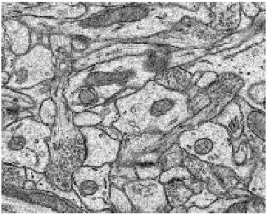
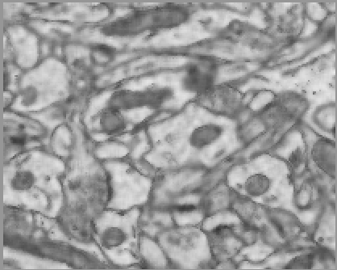

# Digital-Image-Re-Sampling
This  project  re-samples  a  2D  image  by  a  factor  oft,down-sampling if less than 1 and up-sample if greaterthan 1.  The developed code was made in C languageand takes a 2D image and applies bi-linear interpola-tion to scale it. 

